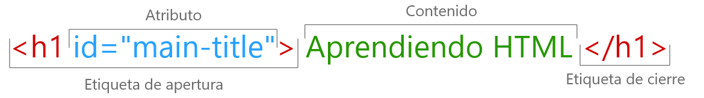
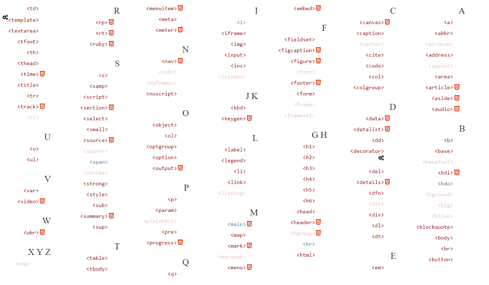

# HTML

Antes [Reglas HTML](./Reglas.md)

- [HTML](#html)
  - [Introducción](#introducción)
    - [¿Que es la W3C?](#que-es-la-w3c)
    - [¿Qué es WHATWG?](#qué-es-whatwg)
  - [Etiquetas](#etiquetas)
    - [Editor de código para HTML](#editor-de-código-para-html)
  - [Estructura Básica de HTML](#estructura-básica-de-html)
- [Elementos HTML](#elementos-html)
  - [1. El elemento `html` - main root](#1-el-elemento-html---main-root)
  - [2. Etiquetas de metadatos](#2-etiquetas-de-metadatos)
    - [`<head>`](#head)
    - [`<title>`](#title)
    - [`<base>`](#base)
    - [`<link>`](#link)
      - [Incluir hojas de estilo](#incluir-hojas-de-estilo)
      - [Hojas de estilos alternativas](#hojas-de-estilos-alternativas)
      - [Iconos](#iconos)
      - [Carga condicional de recursos con consultas de medios](#carga-condicional-de-recursos-con-consultas-de-medios)
    - [`<meta>`](#meta)
      - [Names standard](#names-standard)
    - [`<style>`](#style)
      - [Incluir media query](#incluir-media-query)
  - [3. Secciones](#3-secciones)
    - [`<article>`](#article)
    - [`<section>`](#section)
    - [`<nav>`](#nav)
    - [`<aside>`](#aside)
    - [`<h1>` - `<h6>`](#h1---h6)
    - [`<hgroup>`](#hgroup)
    - [`<header>`](#header)

## Introducción

* `H`yper
* `T`ext
* `M`arkup
* `L`anguage

Lenguaje de marcado de hipertexto.

HTML le dice al navegador (y a los motores de búsqueda) la estructura (elementos, jerarquías, organización) de los documentos.

**"Hipertexto"** se refiere a los enlaces que conectan páginas web entre sí. ya sea dentro de un único sitio web o entre sitios web.

Un elemento HTML se distingue de otro texto en un documento mediante "etiquetas", que consisten en el nombre del elemento rodeadas por `<` y `>`.

El nombre de un elemento dentro de una etiqueta no distingue entre mayúsculas y minúsculas. Por Ej. `<MAIN>` `<Main>` `<main>`.

### ¿Que es la W3C?

La W3C (World Wide Web Consortium) es un comité que se dedica a implementar tecnologías uniformes en el uso y desarrollo de Internet. El organismo fue fundado en el MIT en Cambridge, Massachusetts, EE.UU. en 1994.

El objetivo del W3C es **uniformar las especificaciones técnicas y establecer directrices** para el desarrollo de tecnologías web, de forma que se mantenga la idea básica de la World Wide Web. Tecnologías como HTML, XML, CSS, otros lenguajes de marcado y servicios web son utilizados diariamente por millones de usuarios.

### ¿Qué es WHATWG?

EL (Grupo de trabajo de tecnología de aplicaciones de hipertexto web) por sus siglas en inglés WHATWG es una organización que mantiene y desarrolla HTML y APIs para las aplicaciones Web.

En 2019, **WHATWG** y **W3C** firmaron un acuerdo para colaborar en una única versión de HTML.

## Etiquetas

En HTML exiten elementos que necesitan una etiqueta de apertura y otra de cierre y estas pueden ser utilizadas en forma **anidada**, es decir `<p>This is <em>very <strong>wrong</em>!</strong></p>`. Los elementos deben abrirse y cerrarse ordenadamente.



Tambien existen otras que se las conocen como elementos **self closing** o **vacías** que su principal característica es que no tienen un contenido y no tienen una etiqueta de cierre.


### Editor de código para HTML

Yo recomiendo usar:
* Brackets.io (http://brackets.io/)
* VSCode (https://code.visualstudio.com/)
* Sublime Text (https://www.sublimetext.com/3)

Para aprender lenguajes como HTML y CSS principalmente recomiendo **Brackets.io**

## Estructura Básica de HTML

```html
<!doctype html>
<html lang="es">
<head>
    <meta charset="UTF-8">
    <title>Estructura básica de HTML</title>
</head>
<body>

</body>
</html>
```
Tenemos:

* `<!DOCTYPE html>` Indica que el documento es HTML, es obligatorio empezar el documento con esta línea.
* `<html></html>` Este elemento encierra todo el contenido de la página entera y, a veces, se le conoce como el elemento raíz (*root element*). El atributo `lang=es` nos sirve para devlarar el idioma predeterminado del texto de la página.
* `<head></head>` Este elemento actúa como contenedor de metadatos del documento, los metadatos son información valiosa para el SEO, como los son *title*, *description*, la codificación *meta:viewport* o conjunto de caracteres *charset* y otros elementos como enlaces a archivos CSS y JS.
* `<meta charset="UTF-8">` Establece el juego de caracteres que usará el documento, **utf-8** incluye casi todos los caracteres de todos los idiomas humanos.
* `<title></title>` Establece el titulo del sitio, se muestra en la pestaña del navegador.
* `<body></body>` Encierra todo el contenido, ya sea texto, imágenes, videos, audios, etc.

Otros elementos importantes en la estructura inicial de un documento HTML

* `<meta name="description" content="Página web que nos muestra la estructura básica de un documento HTML">` Es un metadado que indica la descripción general de la página web.
  

Algunos recursos:
* Validator W3C (https://validator.w3.org/#validate_by_input) - Nos ayuda a validar nuestro código HTML

# Elementos HTML

* (https://developer.mozilla.org/en-US/docs/Web/HTML/Element) Muestra todas las etiquetas en HTML
  
* (http://html5doctor.com/element-index/)
* (https://html.spec.whatwg.org/)

**ELEMENTOS HTML**
* `section` Contenido genérico Estruturado
* `article` Contenido estructural distribuible de manera independiente
* `aside` Contenido secundario relacionado al elemento
* `nav` Sección relativa a enlaces dentro del documento o página
* `figure` Sección de contenido visual múltiple, múltiples medios
* `figcaption` Leyenda o pie relativo al contenido visual de figure, un figcaption por cada figure.
* `header` Contenido introductorio, suele tener elementos de navegación y encabezados
* `footer` Sección que contiene información acerca del documento o página
* `main` Contenido principal
* **Video** & **Audio**
  * Nativo, sin plugins ni flash
  * Usabilidad
  * Atributos específicos
  * Fallback
* **Canvas**
  * Dependencias de JS
  * Dinámicos/Interactivos
  * Juegos

## 1. El elemento `html` - main root

| Elemento | Descripción |
| -------- | ----------- |
| `<html>` | El elemento HTML `<html>` representa la raíz del documento. Todos los demás elementos deben de ser descendientes de este elemento. |

Representa la raíz del documento HTML (_**root**_)

Se anima a los autores a especificar un atributo `lang` en el elemento raíz *html*

```html
<html lang="en">
```

## 2. Etiquetas de metadatos

Los metadatos contienen información sobre la página. Esto incluye información sobre estilos, scripts y datos que ayudan al software (search engines, browsers, etc) a usar y generar la página. Los metadatos de *estilos* y *scripts* pueden estar definidos en la página o estar enlazados a otro fichero que contiene la información.

| Elemento | Descripción |
| -------- | ----------- |
| `<head>` | Representa una colección de metadatos para el documento, como `title`, `scripts`, etc. |
| `<title>` | Define el título o nombre del documento. Es muy recomendable usar este elemento puesto que es muy utilizado en los navegadores, historiales. No debe haber más de un elemento `title` por documento. |
| `<base>` | Especifica la URL base que se utilizará para todas las URL relativas en un documento. Solo puede haer un elemento `<base>` en e documento. |
| `<link>` | Permite a los autores vincular su documento a recursos externos. Este elemento se usa más comunmente para vincular hojas de estilo, pero tambié se usa para establecer íconos *"favicon"*, e iconos para la pantalla de inicio y aplicaciones en dispositivos móviles, etc. |
| `<meta>` | Representa varios elementos que no se pueden expresar con los elementos `title`, `base`, `link`, `style` y `scripts` |
| `<style>` | Permite incrustar estilos CSS en sus documentos. El atributo `media` dice a que medios se aplican los estilos. |

### `<head>`

```html
<!DOCTYPE html>
<html lang="en">
<head>
  <meta charset="UTF-8">
  <base href="https://www.example.com/">
  <title>Estudiando los elementos de HTML</title>
  <meta name="description" content="Página web que nos muestra la estructura básica de un documento HTML">
  <meta name="application-name" content="Long headed application"> 
  <link rel="stylesheet" href="default.css">
  <link rel="stylesheet alternate" href="big.css" title="Big text">
  <script src="support.js"></script>
</head>
<body>
    
</body>
</html>
```

### `<title>`

Tenga en cuenta cómo el título describe el tema sin ambiguedades, mientras el título principal aume que el lector sabe cuál es el contexto.

```html
<title>Dances used during bee mating rituals</title>
  ...
<h1>The Dances</h1>
```

### `<base>`

```html
<!doctype html>
<html lang="en">
<head>
  <meta charset="UTF-8">
  <title>Ejemplo para el elemento base</title>
  <base href="https://www.example.com/news/index.html">
</head>
<body>
  <p>Visita los <a href="archives.html">archivos</a></p>
</body>
</html>
```
El link del ejemplo sería un enlace a: *"https://www.example.com/news/archives.html"*

### `<link>`

* (https://developer.mozilla.org/en-US/docs/Web/HTML/Element/link)
* (https://html.spec.whatwg.org/#the-link-element)

#### Incluir hojas de estilo
```html
<link rel="stylesheet" href="estilos.css">
```

#### Hojas de estilos alternativas

El usuario puede elegir cuál hoja de estilos usar, seleccionandola desde el menú Ver > Estilo de página. Esto proporciona una manera en que los usuarios pueden ver múltiles versiones de una misma página.

```html
<link href="default.css" rel="stylesheet" title="Default Style">
<link href="fancy.css" rel="alternate stylesheet" title="Fancy">
<link href="basic.css" rel="alternate stylesheet" title="Basic">
```

#### Iconos

Podemos incluir enlaces a varios iconos diferentes en la misma página, y el navegador elegirá cuál funciona mejor para su contexto particular utilizando los valores *rel* y *sizes* como sugerencias.

```html
<!-- third-generation iPad with high-resolution Retina display: -->
<link rel="apple-touch-icon-precomposed" sizes="144x144" href="favicon144.png">
<!-- iPhone with high-resolution Retina display: -->
<link rel="apple-touch-icon-precomposed" sizes="114x114" href="favicon114.png">
<!-- first- and second-generation iPad: -->
<link rel="apple-touch-icon-precomposed" sizes="72x72" href="favicon72.png">
<!-- non-Retina iPhone, iPod Touch, and Android 2.1+ devices: -->
<link rel="apple-touch-icon-precomposed" href="favicon57.png">
<!-- basic favicon -->
<link rel="icon" href="favicon32.png">
```

#### Carga condicional de recursos con consultas de medios

Este recurso solo cargara si la condición de *media* es true. Por ejemplo:

```html
<link href="print.css" rel="stylesheet" media="print">
<link href="mobile.css" rel="stylesheet" media="all">
<link href="desktop.css" rel="stylesheet" media="screen and (min-width: 600px)">
<link href="highres.css" rel="stylesheet" media="screen and (min-resolution: 300dpi)">
```

### `<meta>`

Se debe especificar exactamente uno de los atributos `name`, `http-equiv`, `charset` e `itemprop`.

Si se especifica `name`, `http-equiv` o `itemprop` tambien se debe especificar el atributo `content`. De lo contrario, debe omitirse.

```html
<meta charset="utf-8">
```

La página principal de una organización de noticias podría incluir la siguiente linea para garantizar que la página se recargue automaticamente desde el servidor cada 5 minutos:
```html
<meta http-equiv="Refresh" content="300">
```

#### Names standard

No distinguen entre mayúsculas y minúsculas

* `application-name` Proporciona el nombre de la aplicación web, Si la página no es una aplicación web, no se debe de utilizar.
* `author` El valor debe de ser una cadena de formato libre con el nombre de uno de los autores de la página
* `description` El valor debe de ser una cadena de formato libre que describa la página
* `generator` El valor debe ser una cadena de formato libre que identifique uno de los paquetes de software para generar el documento.
* `keywords` El valor debe de ser un conjunto de tokens separados por comas, cada uno de los cuales es una palabra clave relevante para la página.
* `referrer` Politica de referencia
* `theme-color` 
* `color-scheme`

### `<style>`

#### Incluir media query

Los siguientes estilos solo se aplican cuando la ventana tiene menos de 500px de ancho.

```html
<!doctype html>
<html>
<head>
  <style media="all and (max-width: 500px)">
    p {
      color: blue;
      background-color: yellow;
    }
  </style> 
</head>
<body>
  <p>This is my paragraph.</p>
</body>
</html>
```

## 3. Secciones

| Elementos | Descripción |
| --------- | ----------- |
| `<body>` | Representa el contenido de un documento HTML. Solo puede haber un `<body>` en un documento |
| `<article>` | Representa una composición completa o autónoma en un documento, página, aplicación, que esta destinado a ser distribuible o reutilizable de forma independiente. |
| `<section>` | Representa una sección genérica de un documento o aplicación. Una sección en este contexto es una agrupación temática de contenido, normalmente con un encabezado. |
| `<nav>` | Representa una sección de página cuy propósito es proporcionar enlaces de navegación, ya sea dentro del documento actual o hacia otros documentos. Los ejemplos comunes de secciones de navegación son menús, tablas de contenido e índices. |
| `<aside>` | Representa una parte de un documento cuyo contenido solo esta relacionado indirectamente con el contenido principal del documento. Estas secciones a menudo se representan como barras laterales en tipografia *printed*, Se usan para publicidad, grupos de elementos de navegación y para otro contenido que se considera separado del contenido principal.|
| `<h1>` - `<h6>` | Estos elementos representan títulos para sus secciones. Estan definidos por rangos siendo `h1` el nivel más alto |
| `<hgroup>` | Representa un encabezado de varios niveles para una seccion de documento. Agrupo un conjunto de elementos `h1`-`h6` |
| `<header>` | Representa contenido introductorio, normalmente un grupo de ayudas introductorias o de navegación. Puede contener algunos elementos de títulos, pero tambien un logotipo, un formulario de búsqueda, un nombre de autor y otros elementos. |
| `<footer>` |  |
| `<address>` |  |

### `<article>`

Cuando los elementos `<article>` están anidados, los elementos del `<article>` interno representan contenidos que en principio están relacionado con el contenido del `<article>` externo.

Este ejemplo muestra una publicación de blog que usa el elemento article, con algunas anotaciones de (Schema.org)

```html
<article itemscope itemtype="http://schema.org/BlogPosting">
 <header>
  <h1 itemprop="headline">The Very First Rule of Life</h1>
  <p><time itemprop="datePublished" datetime="2009-10-09">3 days ago</time></p>
  <link itemprop="url" href="?comments=0">
 </header>
 <p>If there's a microphone anywhere near you, assume it's hot and
 sending whatever you're saying to the world. Seriously.</p>
 <p>...</p>
 <footer>
  <a itemprop="discussionUrl" href="?comments=1">Show comments...</a>
 </footer>
</article>
```
Aquí esta la misma publicación del blog, pero mostrando algunos de los comentarios
```html
<article itemscope itemtype="http://schema.org/BlogPosting">
 <header>
  <h1 itemprop="headline">The Very First Rule of Life</h1>
  <p><time itemprop="datePublished" datetime="2009-10-09">3 days ago</time></p>
  <link itemprop="url" href="?comments=0">
 </header>
 <p>If there's a microphone anywhere near you, assume it's hot and
 sending whatever you're saying to the world. Seriously.</p>
 <p>...</p>

 <section>
  <h1>Comments</h1>

  <article itemprop="comment" itemscope itemtype="http://schema.org/UserComments" id="c1">
   <link itemprop="url" href="#c1">
   <footer>
    <p>Posted by: <span itemprop="creator" itemscope itemtype="http://schema.org/Person">
     <span itemprop="name">George Washington</span>
    </span></p>
    <p><time itemprop="commentTime" datetime="2009-10-10">15 minutes ago</time></p>
   </footer>
   <p>Yeah! Especially when talking about your lobbyist friends!</p>
  </article>

  <article itemprop="comment" itemscope itemtype="http://schema.org/UserComments" id="c2">
   <link itemprop="url" href="#c2">
   <footer>
    <p>Posted by: <span itemprop="creator" itemscope itemtype="http://schema.org/Person">
     <span itemprop="name">George Hammond</span>
    </span></p>
    <p><time itemprop="commentTime" datetime="2009-10-10">5 minutes ago</time></p>
   </footer>
   <p>Hey, you have the same first name as me.</p>
  </article>

 </section>
</article>
```
Observe el uso de `footer` para dar información de cada comentario (como quien lo escriió y cuando): el elemento `footer` puede aparecer al inicio de su sección cuando corresponda, como en este caso. (Usar `header` en este caso tampoco estaría mal; es principalmente una cuestión de preferencia del autor)

### `<section>`

Un ejemplo seria la pagina de inicio de un sitio web, se puede dividir en secciones para una introducción, noticias e información de contacto.

> El elemento `section` no  es un elemento contenedor genérico. 
> Cuando un elemento es necesario solo para fines de estilo o 
> como conveniencia para la creación de scripts, se recomienda a los autores que usen el elemento `div` en su lugar

> Se anima a los autores a utilizar el elemento `article` en lugar de `section` cuando el contenido tenga sentido en su distribución

En el siguiente ejemplo, vemos un artículo (parte de una pagina web más grande) sobre manzanas, que contiene dos secciones cortas.

```html
<article>
 <hgroup>
  <h1>Apples</h1>
  <h2>Tasty, delicious fruit!</h2>
 </hgroup>
 <p>The apple is the pomaceous fruit of the apple tree.</p>

 <section>
  <h1>Red Delicious</h1>
  <p>These bright red apples are the most common found in many
  supermarkets.</p>
 </section>

 <section>
  <h1>Granny Smith</h1>
  <p>These juicy, green apples make a great filling for
  apple pies.</p>
 </section>

</article>
```
Observe como el uso de `section` significa que el autor puede usar elementos `h1` en todo momento sin tener que preocuparse por si una sección en particular está en el nivel superior.

Aquí hay un programa de graduación con dos secciones, una para la lista de personas que se gradúan y otra para la descripción de la ceremonia

```html
<body>
  <h1>Graduation</h1>
  <section>
    <h1>Ceremony</h1>
    <p>Opening Procession</p>
    <p>Speech by Validactorian</p>
    <p>Speech by Class President</p>
    <p>Presentation of Diplomas</p>
    <p>Closing Speech by Headmaster</p>
  </section>
  <section>
    <h1>Graduates</h1>
    <ul>
      <li>Molly Carpenter</li>
      <li>Anastasia Luccio</li>
      <li>Ebenezar McCoy</li>
      <li>Karrin Murphy</li>
      <li>Thomas Raith</li>
      <li>Susan Rodriguez</li>
    </ul>
  </section>
</body>
```

En este ejemplo el autor de un libro ha marcado algunas secciones como capítulos y otras como apéndices, y usa CSS para diseñar los encabezados en estas dos clases de sección de manera diferente.

```html
<style>
 section { border: double medium; margin: 2em; }
 section.chapter h1 { font: 2em Roboto, Helvetica Neue, sans-serif; }
 section.appendix h1 { font: small-caps 2em Roboto, Helvetica Neue, sans-serif; }
</style>

<header>
 <hgroup>
  <h1>My Book</h1>
  <h2>A sample with not much content</h2>
 </hgroup>
 <p><small>Published by Dummy Publicorp Ltd.</small></p>
</header>

<section class="chapter">
 <h1>My First Chapter</h1>
 <p>This is the first of my chapters. It doesn't say much.</p>
 <p>But it has two paragraphs!</p>
</section>

<section class="chapter">
 <h1>It Continues: The Second Chapter</h1>
 <p>Bla dee bla, dee bla dee bla. Boom.</p>
</section>

<section class="chapter">
 <h1>Chapter Three: A Further Example</h1>
 <p>It's not like a battle between brightness and earthtones would go
 unnoticed.</p>
 <p>But it might ruin my story.</p>
</section>

<section class="appendix">
 <h1>Appendix A: Overview of Examples</h1>
 <p>These are demonstrations.</p>
</section>

<section class="appendix">
 <h1>Appendix B: Some Closing Remarks</h1>
 <p>Hopefully this long example shows that you <em>can</em> style
 sections, so long as they are used to indicate actual sections.</p>
</section>
```

### `<nav>`

En el siguiente ejemplo, hay dos elementos de navegación, uno para la navegación principal por el sitio y otro para la navegación secundaria por la propia página.
```html
<body>
  <h1>The Wiki Center Of Exampland</h1>
  <!--Navegación principal (sitio)-->
  <nav>
    <ul>
      <li><a href="/">Home</a></li>
      <li><a href="/events">Current Events</a></li>
      ...more...
    </ul>
  </nav>

  <article>
    <header>
    <h1>Demos in Exampland</h1>
    <p>Written by A. N. Other.</p>
    </header>

    <!--Navegación secundaria (página)-->
    <nav>
    <ul>
      <li><a href="#public">Public demonstrations</a></li>
      <li><a href="#destroy">Demolitions</a></li>
      ...more...
    </ul>
    </nav>

    <div>
      <section id="public">
        <h1>Public demonstrations</h1>
        <p>...more...</p>
      </section>
      <section id="destroy">
        <h1>Demolitions</h1>
        <p>...more...</p>
      </section>
      ...more...
    </div>
    <footer>
      <p><a href="?edit">Edit</a> | <a href="?delete">Delete</a> | <a href="?Rename">Rename</a></p>
    </footer>
  </article>

  <footer>
    <p><small>© copyright 1998 Exampland Emperor</small></p>
  </footer>
</body>
```

La siguiente página tiene varios lugares donde hay enlaces, pero solo uno de esos lugares se considera como una sección de navegación 
```html
<body itemscope itemtype="http://schema.org/Blog">
  
  <header>
    <h1>Wake up sheeple!</h1>
    <p><a href="news.html">News</a> -
      <a href="blog.html">Blog</a> -
      <a href="forums.html">Forums</a></p>
    <p>Last Modified: <span itemprop="dateModified">2009-04-01</span></p>
    <!--Navegación-->
    <nav>
      <h1>Navigation</h1>
      <ul>
        <li><a href="articles.html">Index of all articles</a></li>
        <li><a href="today.html">Things sheeple need to wake up for today</a></li>
        <li><a href="successes.html">Sheeple we have managed to wake</a></li>
      </ul>
    </nav>
  </header>

  <main>
    <article itemprop="blogPosts" itemscope itemtype="http://schema.org/BlogPosting">
      <header>
        <h1 itemprop="headline">My Day at the Beach</h1>
      </header>
      <div itemprop="articleBody">
        <p>Today I went to the beach and had a lot of fun.</p>
        ...more content...
      </div>
      <footer>
        <p>Posted <time itemprop="datePublished" datetime="2009-10-10">Thursday</time>.</p>
      </footer>
    </article>
    ...more blog posts...
  </main>
  <footer>
    <p>Copyright ©
    <span itemprop="copyrightYear">2010</span>
    <span itemprop="copyrightHolder">The Example Company</span>
    </p>
    <p><a href="about.html">About</a> -
      <a href="policy.html">Privacy Policy</a> -
      <a href="contact.html">Contact Us</a></p>
  </footer>
</body>
```
Tambien se puede observar anotaciones de microdatos. (Schema.org)

Un elemento `nav` no tiene que contener una lista, tambien puede contener otros tipos de contenido. En este bloque de navegación, los enlaces se proporcionan en prosa.

```html
<nav>
  <h1>Navigation</h1>
  <p>You are on my home page. To the north lies <a href="/blog">my
  blog</a>, from whence the sounds of battle can be heard. To the east
  you can see a large mountain, upon which many <a
  href="/school">school papers</a> are littered. Far up thus mountain
  you can spy a little figure who appears to be me, desperately
  scribbling a <a href="/school/thesis">thesis</a>.</p>
  <p>To the west are several exits. One fun-looking exit is labeled <a
  href="https://games.example.com/">"games"</a>. Another more
  boring-looking exit is labeled <a
  href="https://isp.example.net/">ISP™</a>.</p>
  <p>To the south lies a dark and dank <a href="/about">contacts
  page</a>. Cobwebs cover its disused entrance, and at one point you
  see a rat run quickly out of the page.</p>
</nav>
```
En este ejemplo, la navegación se utiliza en una aplicación de correo electrónico para permitir que el usuario cambie de carpeta:
```html
<p><input type=button value="Compose" onclick="compose()"></p>
<nav>
  <h1>Folders</h1>
  <ul>
    <li> <a href="/inbox" onclick="return openFolder(this.href)">Inbox</a> <span class=count></span>
    <li> <a href="/sent" onclick="return openFolder(this.href)">Sent</a>
    <li> <a href="/drafts" onclick="return openFolder(this.href)">Drafts</a>
    <li> <a href="/trash" onclick="return openFolder(this.href)">Trash</a>
    <li> <a href="/customers" onclick="return openFolder(this.href)">Customers</a>
  </ul>
</nav>
```

### `<aside>`

El siguiente ejemplo muestra como se usa `aside` para marcar material de fondo sobre Suiza en una noticia mucho mas larga sobre Europa.

```html
<aside>
  <h1>Switzerland</h1>
  <p>Switzerland, a land-locked country in the middle of geographic
  Europe, has not joined the geopolitical European Union, though it is
  a signatory to a number of European treaties.</p>
</aside>
```

El siguiente ejemplo muestra cómo se usa un `aside` para marcar una cita en un artículo más largo.
```html
...

<p>He later joined a large company, continuing on the same work.
<q>I love my job. People ask me what I do for fun when I'm not at
work. But I'm paid to do my hobby, so I never know what to
answer. Some people wonder what they would do if they didn't have to
work... but I know what I would do, because I was unemployed for a
year, and I filled that time doing exactly what I do now.</q></p>

<aside>
  <q> People ask me what I do for fun when I'm not at work. But I'm
  paid to do my hobby, so I never know what to answer. </q>
</aside>

<p>Of course his work — or should that be hobby? —
isn't his only passion. He also enjoys other pleasures.</p>

...
```

El siguiente extracto muestra como se puede usar `aside` para blogs y otros contenidos secundarios en un blog:
```html
<body>
  <header>
    <h1>My wonderful blog</h1>
    <p>My tagline</p>
  </header>

  <aside>
    <!-- this aside contains two sections that are tangentially related
    to the page, namely, links to other blogs, and links to blog posts
    from this blog -->
    <nav>
    <h1>My blogroll</h1>
    <ul>
      <li><a href="https://blog.example.com/">Example Blog</a>
    </ul>
    </nav>

    <nav>
    <h1>Archives</h1>
    <ol reversed>
      <li><a href="/last-post">My last post</a>
      <li><a href="/first-post">My first post</a>
    </ol>
    </nav>
  </aside>

  <aside>
    <!-- this aside is tangentially related to the page also, it
    contains twitter messages from the blog author -->
    <h1>Twitter Feed</h1>
    <blockquote cite="https://twitter.example.net/t31351234">
    I'm on vacation, writing my blog.
    </blockquote>
    <blockquote cite="https://twitter.example.net/t31219752">
    I'm going to go on vacation soon.
    </blockquote>
  </aside>

  <article>
    <!-- this is a blog post -->
    <h1>My last post</h1>
    <p>This is my last post.</p>
    <footer>
    <p><a href="/last-post" rel=bookmark>Permalink</a>
    </footer>
  </article>

  <article>
    <!-- this is also a blog post -->
    <h1>My first post</h1>
    <p>This is my first post.</p>
    <aside>
    <!-- this aside is about the blog post, since it's inside the
    <article> element; it would be wrong, for instance, to put the
    blogroll here, since the blogroll isn't really related to this post
    specifically, only to the page as a whole -->
    <h1>Posting</h1>
    <p>While I'm thinking about it, I wanted to say something about
    posting. Posting is fun!</p>
    </aside>
    <footer>
    <p><a href="/first-post" rel=bookmark>Permalink</a>
    </footer>
  </article>

  <footer>
    <p><a href="/archives">Archives</a> -
    <a href="/about">About me</a> -
    <a href="/copyright">Copyright</a></p>
  </footer>
</body>
```

### `<h1>` - `<h6>`

En lo que respecta a sus respectivos esquemas de documentos (sus estructuras de encabezado y sección), estos dos fragmentos son semánticamente equivalentes
```html
<body>
  <h1>Let's call it a draw(ing surface)</h1>
  <h2>Diving in</h2>
  <h2>Simple shapes</h2>
  <h2>Canvas coordinates</h2>
  <h3>Canvas coordinates diagram</h3>
  <h2>Paths</h2>
</body>
```
```html
<body>
  <h1>Let's call it a draw(ing surface)</h1>
  <section>
    <h1>Diving in</h1>
  </section>
  <section>
    <h1>Simple shapes</h1>
  </section>
  <section>
    <h1>Canvas coordinates</h1>
    <section>
      <h1>Canvas coordinates diagram</h1>
    </section>
  </section>
  <section>
    <h1>Paths</h1>
  </section>
</body>
```

Los autores pueden preferir el primer estilo por su consición, o el segundo estilo por su conveniencia frente a una edición intensa; cuál es el mejor? Es puramente una cuestión de estilo preferido por el autor.

Los dos estilos se pueden combinar para lograr compatibilidad con herramientas heredadas y, al mismo tiempo, estar preparadas para cuando esa compatibilidad ya no sea necesaria. Este tercer gragmento nuevamente tiene el mismo esquema que los dos anteriores.
```html
<body>
  <h1>Let's call it a draw(ing surface)</h1>
  <section>
    <h2>Diving in</h2>
  </section>
  <section>
    <h2>Simple shapes</h2>
  </section>
  <section>
    <h2>Canvas coordinates</h2>
    <section>
    <h3>Canvas coordinates diagram</h3>
    </section>
  </section>
  <section>
    <h2>Paths</h2>
  </section>
</body>
```

### `<hgroup>`

La principal razón de agrupar títulos, es para que el user agent relacione el titulo secundario con el principal, y no cree otra relación independiente.

Ejemplos
```html
<hgroup>
  <h1>The reality dysfunction</h1>
  <h2>Space is not the only void</h2>
</hgroup>
```
El user agent podria renderizar asi:
```
The reality dysfunction: Space is not the only void
```
alternativamente
```
The reality dysfunction (Space is not the only void)
```

Los siguientes dos ejemplos muestran formas en las que dos encabezados `h1` podrían usarse dentro de un elemento `hgroup` para agrupar los nombres de EEUU y Reino Unido para la misma película.
```html
<hgroup>
 <h1>The Avengers</h1>
 <h1>Avengers Assemble</h1>
</hgroup>

<hgroup>
 <h1>Avengers Assemble</h1>
 <h1>The Avengers</h1>
</hgroup>
```
Lo que indica es como los nombres de las peliculas pueden agruparse. Con el nombre estadounidense The Avengers como título (principal) y el nombre del Reino Unido Avengers Assemble como título alternativo (secundario). El segundo ejemplo anterior muestra cómo se pueden agrupar los nombres de las películas en una publicación en el Reino Unido, con el nombre del Reino Unido como título (principal) y el nombre de EE. UU. Como título alternativo (secundario).

En ambos casos es importante tener en cuenta que el uso del elemento hgroup para agrupar los dos títulos indica que los títulos no son equivalentes, el primer h1 da el título (principal) mientras que el segundo da el título alternativo (secundario)

Aunque tanto el título como el título alternativo están marcados con elementos h1, en una vista renderizada de la salida del algoritmo de esquema, el segundo h1 en el grupo h se mostrará de alguna manera que indique claramente que es secundario; por ejemplo:

```
The Avengers (Avengers Assemble)
```
```
Avengers Assemble (The Avengers)
```

En el siguiente ejemplo, se utiliza un elemento hgroup para marcar un encabezado de dos niveles en un cuadro de dialogo estilo asistente(wizard-style)

```html
<dialog onclose="walletSetup.continue(this.returnValue)">
  <hgroup>
    <h1>Wallet Setup</h1>
    <h2>Configure your Wallet funding source</h2>
  </hgroup>
  <p>Your Wallet can be used to buy wands at the merchant in town, to buy potions from travelling
  salesmen you may find in the dungeons, and to pay for mercenaries.</p>
  <p>We support two payment sources:</p>
  <form method=dialog>
    <fieldset oninput="this.getElementsByTagName('input')[0].checked = true">
    <legend> <label> <input type=radio name=payment-type value=cc> Credit Card </label> </legend>
    <p><label>Name on card: <input name=cc1 autocomplete="section-cc cc-name" placeholder="Y. Name"></label>
    <p><label>Card number: <input name=cc2 inputmode=numeric autocomplete="section-cc cc-number" placeholder="6331 1019 9999 0016"></label>
    <p><label>Expiry Date: <input name=cc3 type=month autocomplete="section-cc cc-exp" placeholder="2020-02"></label>
    <p><label>Security Code: <input name=cc4 inputmode=numeric autocomplete="section-cc cc-csc" placeholder="246"></label>
    </fieldset>
    <fieldset oninput="this.getElementsByTagName('input')[0].checked = true">
    <legend> <label> <input type=radio name=payment-type value=bank> Checking Account </label> </legend>
    <p><label>Name on account: <input name=bank1 autocomplete="section-bank cc-name"></label>
    <p><label>Routing number: <input name=bank2 inputmode=numeric></label>
    <p><label>Account number: <input name=bank3 inputmode=numeric></label>
    </fieldset>
    <button type=submit value="back"> ← Back </button>
    <button type=submit value="next"> Next → </button>
  </form>
</dialog>
```

### `<header>`

Ejemplo para un juego
```html
<header>
  <p>Welcome to...</p>
  <h1>Voidwars!</h1>
</header>
```

Ejemplo para marcar el encabezado de una especificación
```html
<header>
  <hgroup>
    <h1>Fullscreen API</h1>
    <h2>Living Standard — Last Updated 19 October 2015</h2>
  </hgroup>
  <dl>
    <dt>Participate:</dt>
    <dd><a href="https://github.com/whatwg/fullscreen">GitHub whatwg/fullscreen</a></dd>
    <dt>Commits:</dt>
    <dd><a href="https://github.com/whatwg/fullscreen/commits">GitHub whatwg/fullscreen/commits</a></dd>
  </dl>
</header>
```
El elemento `header` no divide el contenido, no introduce una nueva sección

En este ejemplo el `header` contiene un `h1` y dos subsecciones `h2`. El contenido despues del `header` sigue siendo parte de la última subsección iniciada por el elemento `header`.

> El elemento `header` no participa en el algoritmo de esquema
```html
<body>
  <header>
    <h1>Little Green Guys With Guns</h1>
    <nav>
    <ul>
      <li><a href="/games">Games</a>
      <li><a href="/forum">Forum</a>
      <li><a href="/download">Download</a>
    </ul>
    </nav>
    <h2>Important News</h2> <!-- Empieza la segunda subsección -->
    <!-- this is part of the subsection entitled "Important News" -->
    <p>To play today's games you will need to update your client.</p>
    <h2>Games</h2> <!-- Empieza la tercera subsección -->
  </header>
  <p>You have three active games:</p>
  <!-- Esto sigue perteneciendo a la tercera subsección "Games" -->
  ...
```

<br><br><br><br><br><br><br><br><br><br><br><br><br><br><br>


