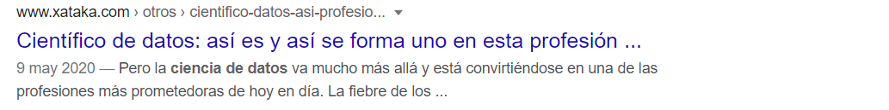

# HTML

- [HTML](#html)
  - [Introducción](#introducción)
    - [¿Que es la W3C?](#que-es-la-w3c)
    - [¿Qué es WHATWG?](#qué-es-whatwg)
  - [Etiquetas](#etiquetas)
    - [Editor de código para HTML](#editor-de-código-para-html)
  - [Estructura Básica de HTML](#estructura-básica-de-html)

## Introducción

* `H`yper
* `T`ext
* `M`arkup
* `L`anguage

Lenguaje de marcado de hipertexto.

HTML le dice al navegador (y a los motores de búsqueda) la estructura (elementos, jerarquías, organización) de los documentos.

**"Hipertexto"** se refiere a los enlaces que conectan páginas web entre sí. ya sea dentro de un único sitio web o entre sitios web.

Un elemento HTML se distingue de otro texto en un documento mediante "etiquetas", que consisten en el nombre del elemento rodeadas por `<` y `>`.

El nombre de un elemento dentro de una etiqueta no distingue entre mayúsculas y minúsculas. Por Ej. `<MAIN>` `<Main>` `<main>`.

### ¿Que es la W3C?

La W3C (World Wide Web Consortium) es un comité que se dedica a implementar tecnologías uniformes en el uso y desarrollo de Internet. El organismo fue fundado en el MIT en Cambridge, Massachusetts, EE.UU. en 1994.

El objetivo del W3C es **uniformar las especificaciones técnicas y establecer directrices** para el desarrollo de tecnologías web, de forma que se mantenga la idea básica de la World Wide Web. Tecnologías como HTML, XML, CSS, otros lenguajes de marcado y servicios web son utilizados diariamente por millones de usuarios.

### ¿Qué es WHATWG?

EL (Grupo de trabajo de tecnología de aplicaciones de hipertexto web) por sus siglas en inglés WHATWG es una organización que mantiene y desarrolla HTML y APIs para las aplicaciones Web.

En 2019, **WHATWG** y **W3C** firmaron un acuerdo para colaborar en una única versión de HTML.

## Etiquetas

En HTML exiten elementos que necesitan una etiqueta de apertura y otra de cierre y estas pueden ser utilizadas en forma **anidada**, es decir `<p>This is <em>very <strong>wrong</em>!</strong></p>`. Los elementos deben abrirse y cerrarse ordenadamente.


Tambien existen otras que se las conocen como elementos **self closing** o **vacías** que su principal característica es que no tienen un contenido y no tienen una etiqueta de cierre.


### Editor de código para HTML

Yo recomiendo usar:
* Brackets.io (http://brackets.io/)
* VSCode (https://code.visualstudio.com/)
* Sublime Text (https://www.sublimetext.com/3)

Para aprender lenguajes como HTML y CSS principalmente recomiendo **Brackets.io**

## Estructura Básica de HTML

```html
<!DOCTYPE html>
<html lang="es">
<head>
    <meta charset="UTF-8">
    <title>Estructura básica de HTML</title>
</head>
<body>

</body>
</html>
```
Tenemos:

* `<!DOCTYPE html>` Indica que el documento es HTML, es obligatorio empezar el documento con esta línea.
* `<html></html>` Este elemento encierra todo el contenido de la página entera y, a veces, se le conoce como el elemento raíz (*root element*). El atributo `lang=es` nos sirve para devlarar el idioma predeterminado del texto de la página.
* `<head></head>` Este elemento actúa como contenedor de metadatos del documento, los metadatos son información valiosa para el SEO, como los son *title*, *description*, la codificación *meta:viewport* o conjunto de caracteres *charset* y otros elementos como enlaces a archivos CSS y JS.
* `<meta charset="UTF-8">` Establece el juego de caracteres que usará el documento, **utf-8** incluye casi todos los caracteres de todos los idiomas humanos.
* `<title></title>` Establece el titulo del sitio, se muestra en la pestaña del navegador.
* `<body></body>` Encierra todo el contenido, ya sea texto, imágenes, videos, audios, etc.

Otros elementos importantes en la estructura inicial de un documento HTML

* `<meta name="description" content="Página web que nos muestra la estructura básica de un documento HTML">` Es un metadado que indica la descripción general de la página web.
  

Algunos recursos:
* Validator W3C (https://validator.w3.org/#validate_by_input) - Nos ayuda a validar nuestro código HTML


<br><br><br><br><br><br><br><br><br><br><br><br><br><br><br>


